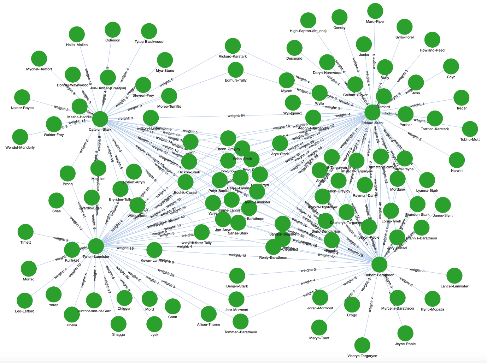

# Sample Queries

## Count the number of Person Verticies

We will use the size() function:

```gsql
CREATE DISTRIBUTED QUERY countPeople() FOR GRAPH got SYNTAX V1 {
  # The seed is all Person verticies   
  People = {Person.*};
  # The size operator counts the number of entry points into the graph
  PRINT People.size();
}
```

We can also use a SELECT clause:

```gsql
CREATE DISTRIBUTED QUERY countPeople() FOR GRAPH got Syntax V2{ 
  People = {Person.*};
  Results = SELECT p FROM Peole:p;
  PRINT Result.size();
}
```

## Results

```
[
  {
    "\"countPeople works!\"": "countPeople works!"
  },
  {
    "R.size()": 187
  }
]
```

## Counting the Number of Edges

We can use an accumulator to count the number of edges in the graph.

```gsql
CREATE DISTRIBUTED QUERY countEdges() FOR GRAPH got { 
  SumAccum<INT> @@edgeCount;

  # Get all the vertices from ANY vertex Type
  start = {ANY};
  edgeCountQuery = SELECT s
                   FROM start:s -(:e)- :d
                   ACCUM @@edgeCount += 1;
  # total edges is half since we are traversing each edge from the start to the destinaton
  PRINT @@edgeCount/2;
}
```

We kept a placeholder alias for the edge called ```:e``` and the desitination :d, but we could have left out the edge:

```gsql
edgeCountQuery = SELECT s
                FROM start:s -()- :d
                ACCUM @@edgeCount += 1;
```

Response:


Note that this works because there is only one edge type between people.

## Selecting All People

```gsql
CREATE DISTRIBUTED QUERY listNames(/* Parameters here */) FOR GRAPH got {
  People = {Person.*};
  Results = SELECT p FROM People:p;
  PRINT Results;
}
```

## Selecting the Most Popular People

### Outdegree Method

We can use the ```outdegree()``` function to find the people with over 40 connections to other people.

```gsql
/* main characters that have at over 40 connections */
CREATE DISTRIBUTED QUERY personDegree() FOR GRAPH got { 
  start = {Person.*};
  mainChars = 
    SELECT s
    FROM start:s -(RELATED:e)- :t
    WHERE s.outdegree() > 40;
  PRINT mainChars;
}
```

You can also add a parameter to outdegree to indicate the relationship type ```s.outdegree(RELATED)```.

Result:

```json
[
  {
    "mainChars": [
      {
        "attributes": {
          "id": "Eddard-Stark",
          "name": "Eddard-Stark"
        },
        "v_id": "Eddard-Stark",
        "v_type": "Person"
      },
      {
        "attributes": {
          "id": "Robert-Baratheon",
          "name": "Robert-Baratheon"
        },
        "v_id": "Robert-Baratheon",
        "v_type": "Person"
      },
      {
        "attributes": {
          "id": "Catelyn-Stark",
          "name": "Catelyn-Stark"
        },
        "v_id": "Catelyn-Stark",
        "v_type": "Person"
      },
      {
        "attributes": {
          "id": "Tyrion-Lannister",
          "name": "Tyrion-Lannister"
        },
        "v_id": "Tyrion-Lannister",
        "v_type": "Person"
      }
    ]
  }
]
```

Expanding these nodes gives you the following:



You can now see the people that connect the characters.

## Returning All Edges

By default, we usually only return the vertices in a query result and then click on the vertices to see the structure.
However, we can also return the edges directly to the output using accumulators.

```gsql
CREATE QUERY returnAllEdges() FOR GRAPH got {
  SetAccum<EDGE> @@edges;
  
  // Assuming the vertices are of type Person and edges are of type RELATED
  start = {Person.*};
  result = SELECT s
           FROM start:s - (RELATED:e) -> Person:t
           ACCUM @@edges += e;

  PRINT @@edges;
}
```

This will display all the edges directly into the output window.

The Radial view will show the following:

~[](./img/radial-view.png)